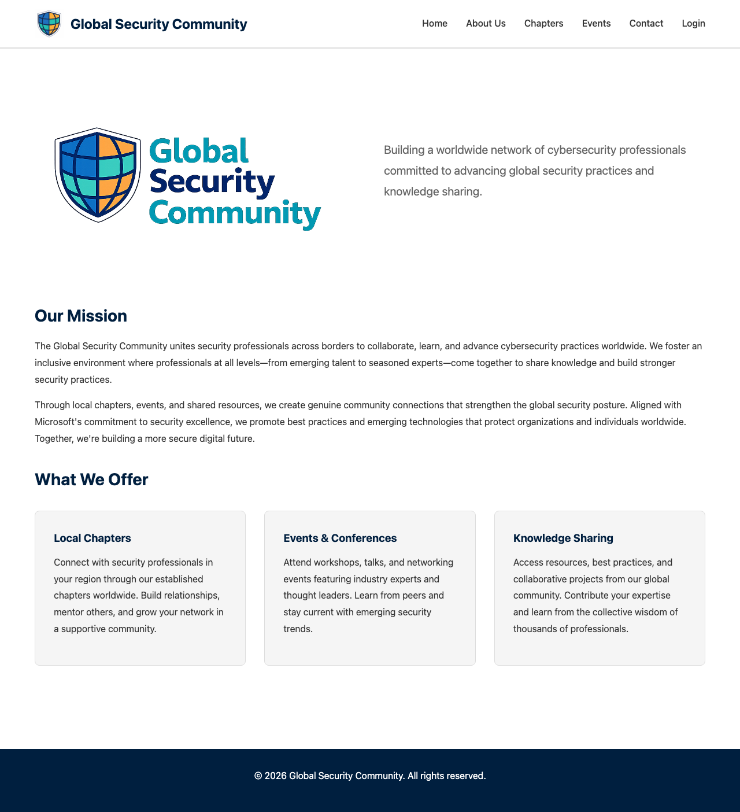
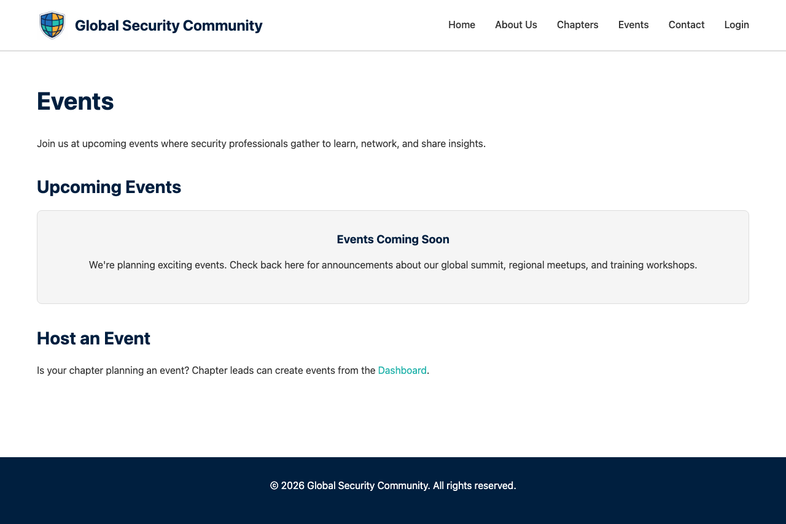
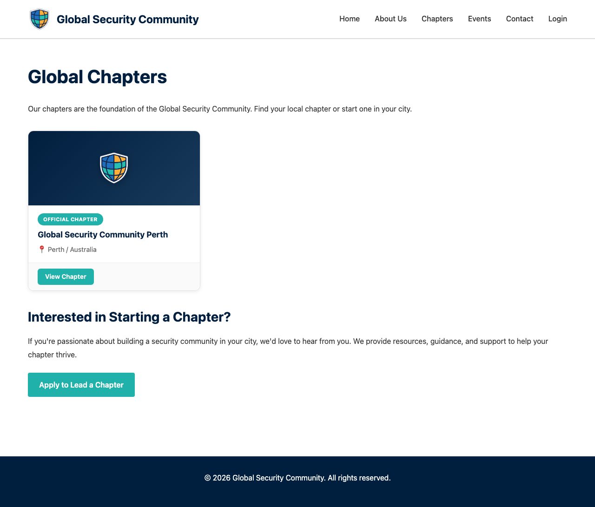
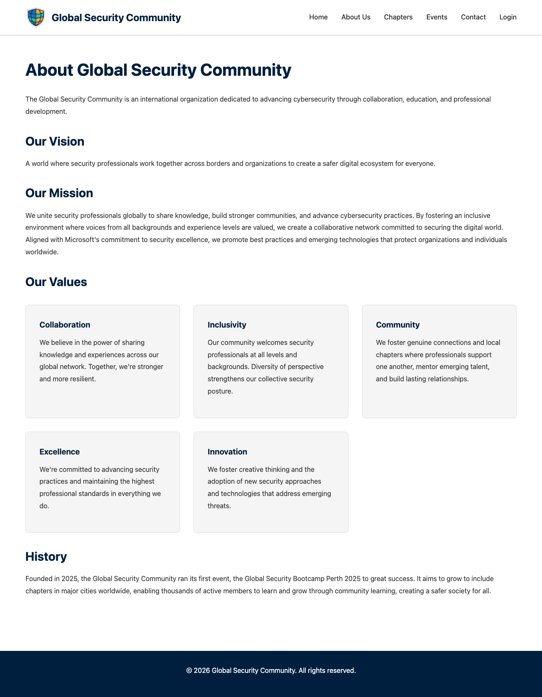

# Browsing the Site

The GSC website is the central hub for the Global Security Community. Here's what you'll find on each page.

---

## Homepage

The homepage introduces the community and provides quick navigation to all sections.

From the top navigation bar you can access:
- **Home** — The main landing page
- **About Us** — Learn about the GSC mission and team
- **Chapters** — Find your local chapter
- **Events** — Browse upcoming events
- **Contact** — Get in touch with us

If you're not logged in, you'll see a **Login** link in the navigation.

---

## Events

The events page lists all upcoming community events across all chapters.

Click on any event card to see full details including:
- Date and time
- Location / venue
- Agenda with session schedule
- Speaker lineup
- Registration button

### Event Detail Page

Each event has a dedicated page with all the information you need.

Key sections on an event page:
- **Event summary** — Date, location, and registration count
- **Register Now** button — Takes you to the registration form
- **About This Event** — Description of what to expect
- **Agenda** — Session schedule (powered by Sessionize)
- **Speakers** — Presenter profiles and bios
- **Location** — Venue details with map

---

## Chapters

Chapters are local communities of cybersecurity professionals. Each chapter organises its own events and meetups.

Click on a chapter card to visit that chapter's page.

### Chapter Page

Each chapter has its own page with information about the chapter leads and their social links.

---

## About Us

Learn about the Global Security Community's mission, values, and the team behind it.

---

## Contact

Have a question or want to get involved? Use the contact form.

The contact form requires:
- **Name** — Your full name
- **Email** — Where we can reply to you
- **Subject** — What your message is about
- **Message** — Your question or feedback

Messages are sent to the GSC team and you'll receive a confirmation email.
