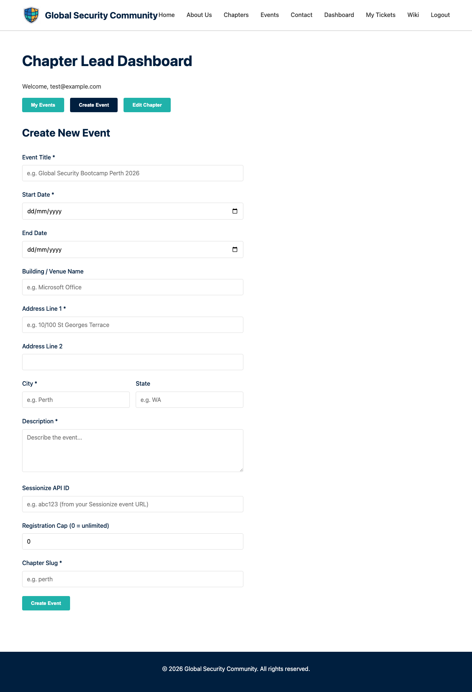

# Creating Events

Chapter leads can create events for their chapter from the admin dashboard.

---

## Opening the Create Event Form

1. Go to the **Dashboard**
2. Click the **Create Event** button

---

## Event Fields

Fill in the following details:

| Field | Description | Required |
|-------|-------------|----------|
| **Title** | Name of the event | ✅ |
| **Slug** | URL-friendly identifier (auto-generated from title) | ✅ |
| **Date** | Event start date | ✅ |
| **End Date** | Event end date (for multi-day events) | Optional |
| **Location** | Venue name and address | ✅ |
| **Description** | What the event is about | ✅ |
| **Registration Cap** | Maximum number of attendees (0 = unlimited) | Optional |
| **Status** | open, closed, or completed | ✅ |
| **Sessionize ID** | Sessionize event ID for agenda/speaker integration | Optional |

---

## After Creating

Once created:
- The event appears in your dashboard's event list
- A **static page** is generated for the event at `/events/<slug>/`
- The event is listed on the public **Events** page
- Attendees can register via the **Register Now** button

---

## Editing Events

Currently, events can be edited by updating the event details through the dashboard. The event page will reflect changes after the next site build.

---

## Sessionize Integration

If your event uses [Sessionize](https://sessionize.com/) for call-for-papers and agenda management, enter the Sessionize event ID. The event page will automatically display:
- **Agenda** — Session grid with times and tracks
- **Speakers** — Speaker cards with photos and bios
