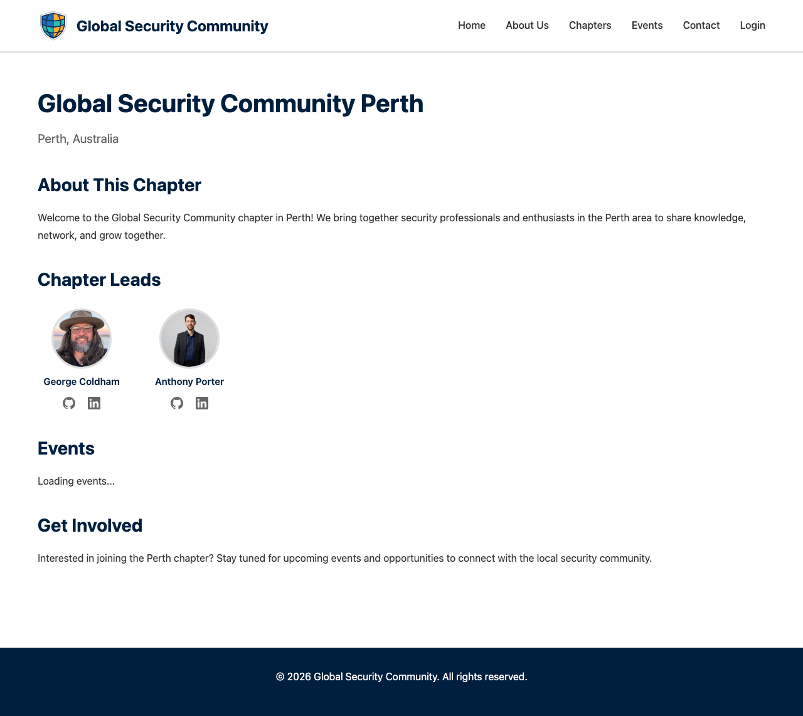

# Editing Your Chapter

Chapter leads can update their chapter's information from the admin dashboard.

---

## Opening the Chapter Editor

1. Go to the **Dashboard**
2. Click the **Edit Chapter** button

---

## What You Can Edit

### Chapter Leads

You can list up to **4 chapter leads**, each with:
- **Name** — The lead's full name
- **LinkedIn URL** — Link to their LinkedIn profile

### Social Links

Connect your chapter's online presence:
- **GitHub** — Chapter's GitHub organisation or repo
- **LinkedIn** — Chapter's LinkedIn page
- **Twitter/X** — Chapter's Twitter/X handle
- **Website** — Chapter's external website

---

## Saving Changes

1. Make your edits
2. Click **Save Changes**
3. The chapter page at `/chapters/<your-chapter>/` will be updated automatically

> **Note:** Changes take effect after the site rebuilds, which usually happens within a few minutes.

---

## What the Chapter Page Shows

Your chapter page displays:
- Chapter name and city
- Chapter leads with their social links
- Upcoming events for your chapter
- Social media links

