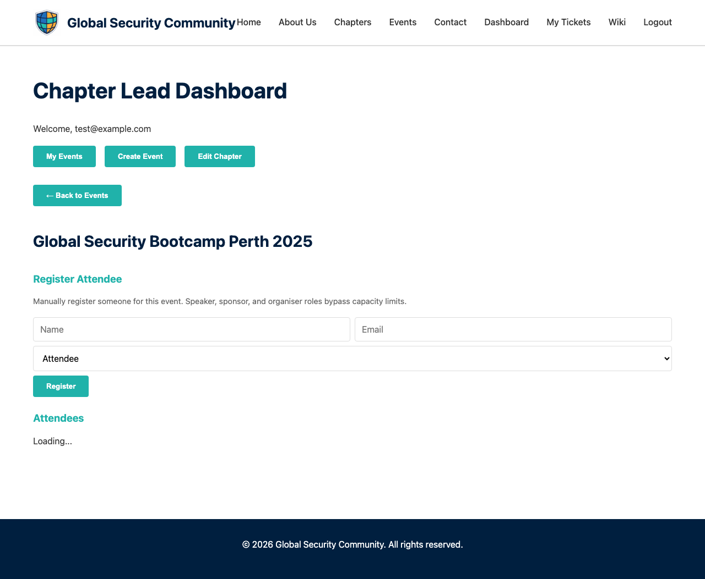

# Managing Attendees

Chapter leads can manage event attendees from the dashboard's event detail view.

---

## Viewing Attendees

1. Go to the **Dashboard**
2. Click on an event card
3. The attendee list shows all registered participants

Each row shows:
- **Name** and **email**
- **Role badge** — Attendee, Volunteer, Speaker, Sponsor, or Organiser
- **Check-in status** — Whether they've been checked in
- **Volunteer interest** — 🙋 icon if they expressed interest in volunteering

---

## Attendee Roles

You can assign roles to attendees using the role checkboxes:

| Role | Description |
|------|-------------|
| **Attendee** | Default role for registered participants |
| **Volunteer** | Helps run the event (gains Scanner access) |
| **Speaker** | Presenting at the event |
| **Sponsor** | Representing a sponsoring organisation |
| **Organiser** | Chapter lead or event organiser |

Changing a role updates the attendee's access level and badge display.

---

## Check-In

Check in attendees as they arrive:
- Use the **[QR Scanner](QR-Scanner)** for quick mobile check-in
- Or click the check-in button next to each attendee's name

---

## Manual Registration

For walk-in attendees who didn't pre-register:
1. Scroll to the **Manual Registration** section
2. Enter their name, email, and role
3. Click **Register** to add them to the attendee list

---

## CSV Export

Click **Download CSV** to export the full attendee list including:
- Name, email, role, check-in status, registration time, and volunteer interest

---

## Issue Badges

Click **Issue Badges** to generate and email event badges to all attendees. Each badge includes:
- Attendee name
- Event title and date
- Their role at the event
