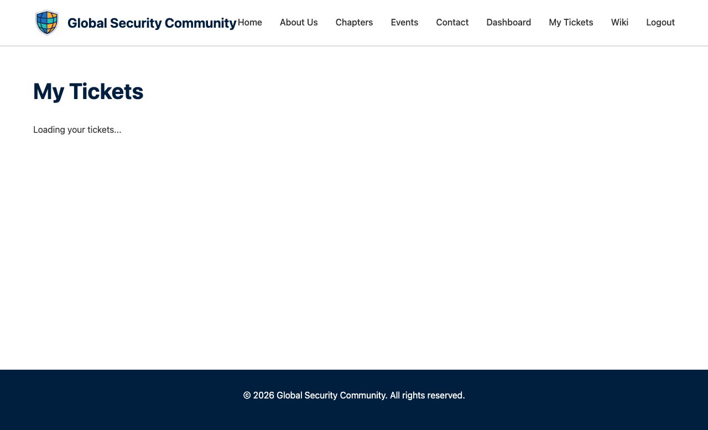

# My Tickets

The My Tickets page shows all your event registrations in one place.

---

## Accessing My Tickets

Click **My Tickets** in the navigation bar (visible when logged in).

---

## What You'll See

Each ticket shows:
- **Event name** — Which event you're registered for
- **Date and location** — When and where
- **Your role** — Attendee, volunteer, speaker, etc.
- **QR code** — For check-in at the event

---

## Using Your QR Code

When you arrive at an event:
1. Open your ticket on the **My Tickets** page
2. Show your QR code to the volunteer at the check-in desk
3. They'll scan it with the [QR Scanner](QR-Scanner) to mark you as checked in

> **Tip:** Save a screenshot of your QR code in case you have limited internet access at the venue.

---

## Cancelling a Registration

If you can no longer attend an event:
1. Find the ticket on the My Tickets page
2. Click the **Cancel Registration** button
3. Confirm the cancellation

Your spot will be freed up for other attendees.
