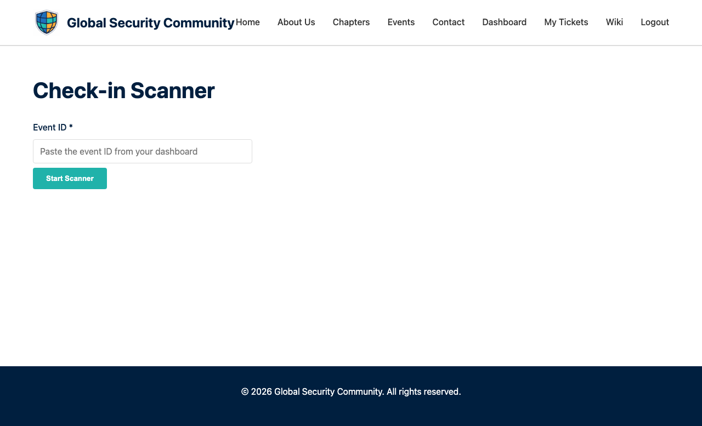

# QR Scanner

The QR scanner is used by event volunteers and admins to check in attendees at events.

---

## Accessing the Scanner

Click **Scanner** in the navigation bar (visible to admin and volunteer users).

---

## How to Use

1. Open the scanner page on your phone or tablet
2. Select the event you're checking in for
3. Point your camera at the attendee's QR code (found on their [My Tickets](My-Tickets) page)
4. The scanner reads the code and marks the attendee as checked in
5. You'll see a confirmation with the attendee's name and role

---

## Tips for Smooth Check-In

- **Use a mobile device** — The scanner works best on phones and tablets with a rear camera
- **Good lighting helps** — Ensure the QR code is well-lit
- **Have a backup** — If scanning fails, admins can check in attendees manually from the dashboard
- **Test beforehand** — Try scanning your own ticket before the event starts

---

## Who Can Use the Scanner

| Role | Access |
|------|--------|
| **Admin** | ✅ Full access |
| **Volunteer** | ✅ Scanner access |
| **Attendee** | ❌ No access |

Volunteers gain scanner access when a chapter lead assigns them the `volunteer` role.
