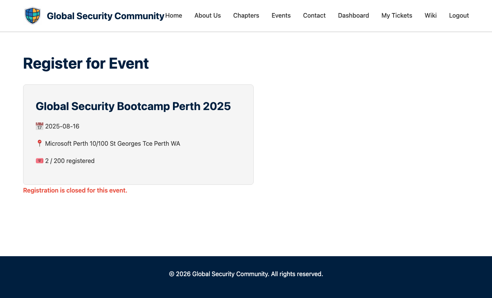

# Registering for Events

Once you're logged in, you can register for any upcoming event.

---

## Finding an Event

1. Go to the **Events** page from the navigation bar
2. Browse the list of upcoming events
3. Click on an event to see its full details

---

## Registering

1. On the event detail page, click the **Register Now** button
2. You'll be taken to the registration form (you must be logged in)

The registration form shows:
- **Event summary** — Title, date, location, and current registration count
- **Your name** — Pre-filled from your account if available
- **Your email** — Pre-filled from your login

3. Fill in or confirm your details
4. Optionally, express your [volunteer interest](Volunteering)
5. Click **Register** to complete your registration

---

## After Registering

- You'll receive a **confirmation email** with your event details
- Your ticket will appear on the **[My Tickets](My-Tickets)** page
- Each ticket includes a **QR code** for check-in at the event

---

## Registration Limits

Some events have a capacity limit. If an event is full, the registration form will show a message and you won't be able to register. Keep an eye on events — spots may open up if others cancel.

---

## Cancelling a Registration

If you can no longer attend, you can cancel your registration from the **[My Tickets](My-Tickets)** page. This frees up your spot for someone else.
